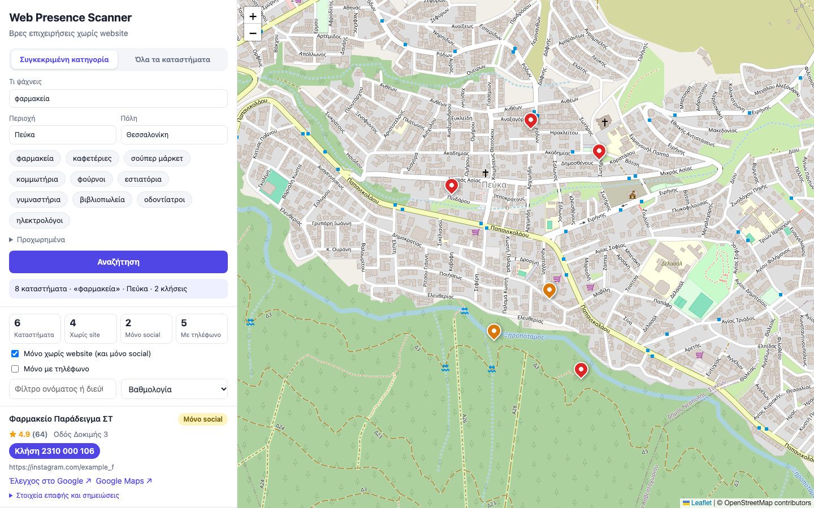

# Web Presence Scanner

Finds local businesses (cafes, pharmacies, shops, ...) that have **no website** or a **dead website**, so a freelance web developer can phone them and offer to build one. It turns public map data into a call list.



*Screenshot uses fictional demo data. Try it yourself with no API keys: `python scripts/demo_server.py` (see [Demo](#demo)).*

## Features

- **Two data sources behind one interface**
  - **OpenStreetMap** (Nominatim + Overpass): free, can be stored; phone numbers are often missing.
  - **Google Places API (New)**: phone, website, rating and opening hours; shown live and never stored.
- **Lead classification**: `none` (no website listed), `dead` (DNS/TLS/connection error, timeout, 4xx/5xx), `social_only` (Facebook, Instagram, Linktree, ...), `alive`.
- **Greek dashboard**, Google-Maps style: search and result cards on the left (rating, website status, phone, your own email/notes), coloured pins on the map on the right. Two modes: one category ("φαρμακεία") or **all businesses** in an area, split automatically where Google caps results. **Open now / closed** shown on every card (with today's hours and a "only open now" filter), so you know whether it is a good moment to call. Click-to-call, manual phone/email entry, a "verified: I checked on Google" tick, contact status, filters and sorting.
- **Ambiguous place names** (there are many "Πεύκα" in Greece) show a list of candidates to pick from.
- **Cost guard** for Google: every request is counted, and a hard monthly limit stops the tool before the free tier ends.
- **Do-not-call** flag that removes a business from every list.

## Tech stack

| Layer | What |
|---|---|
| Backend | Python 3.12, FastAPI + uvicorn, `httpx`, SQLite (`sqlite3`), `python-dotenv` |
| Frontend | Plain HTML, CSS and vanilla JavaScript (no build step), [Leaflet](https://leafletjs.com) for the map |
| Tests | pytest, with mocked network (no real requests in the test suite) |

```
finder/
  sources/          base.py (Area, Business, Source), osm.py, google_places.py
  checker.py        website liveness check (async httpx, limited concurrency)
  db.py             schema, migrations, queries
  api.py            FastAPI app (JSON API + serves web/)
  cli.py            scan / check / list / serve
web/                dashboard (google.html = main page with the map, index.html = older OSM table)
scripts/            demo_server.py (fictional data)
tests/
```

## Setup

```
python3.12 -m venv .venv
source .venv/bin/activate
pip install -r requirements.txt
cp .env.example .env      # then edit .env
pytest
```

## Usage

```
# OpenStreetMap: collect, check websites, browse
python -m finder.cli scan --area "Πεύκα" --category cafe --hint Θεσσαλονίκη
python -m finder.cli check
python -m finder.cli list --status none

# Dashboard (listens on localhost only)
python -m finder.cli serve --port 8765
```

Open `http://127.0.0.1:8765/`: Google search with the map. (The older OpenStreetMap table is at `/osm`.)

### Google Places (optional)

1. Create a Google Cloud project, enable **Places API (New)** and create an API key restricted to that API.
2. Put it in `.env`: `GOOGLE_PLACES_API_KEY=...` (never commit it; `.env` is git-ignored).
3. `GOOGLE_MONTHLY_CALL_LIMIT` (default 900) is the tool's own hard stop. Check current prices at <https://developers.google.com/maps/billing-and-pricing/pricing>.

Google's terms do not allow a permanent copy of their data, so only the `place_id` and your own fields (notes, contact status, phone you typed) are saved.

## Demo

```
python scripts/demo_server.py
```

Opens a server with fictional businesses and no network calls to Google or OSM. Visit `http://127.0.0.1:8770/?q=φαρμακεία&area=Πεύκα&auto=1`.

## Design notes

- **IPv4 by default:** some home networks cannot reach Google over IPv6, which makes searches hang. Connections use IPv4 with a short connect timeout (`FORCE_IPV4=0` in `.env` turns that off).
- **Polite data access**: descriptive User-Agent, spaced-out requests and an on-disk cache of raw Overpass/Nominatim responses.
- **Safe checker**: timeouts, one retry, limited concurrency. Only ordinary GET requests to public websites: no port scanning, no vulnerability probing.
- **Security basics**: server bound to `127.0.0.1`; parameterised SQL and a whitelist for sort columns; DOM built with `textContent` (no `innerHTML` with data); only `http(s)` links; CSV cells that start with `=`, `+`, `-`, `@` are escaped against formula injection; API key never appears in error messages.
- **Missing is not proof**: a business without a website in a data source may still have one, so every result links to a Google search to verify before calling.
- **Cold-calling note**: these are B2B calls in Greece. If someone asks not to be contacted, mark them `do_not_call`.

## Roadmap

- [x] Phase 0: project skeleton
- [x] Phase 1: OpenStreetMap source and CLI `scan`
- [x] Phase 2: SQLite storage and deduplication
- [x] Phase 3: website checker and CLI `check`
- [x] Phase 4: FastAPI dashboard
- [x] Phase 5: Google Places as a second source (tested with mocked responses)

## Data attribution and licences

Business data © OpenStreetMap contributors, available under the [ODbL](https://opendatacommons.org/licenses/odbl/). Map tiles © OpenStreetMap contributors. Place data from Google Places is shown live under Google's terms. [Leaflet](https://leafletjs.com) 1.9.4 (BSD-2-Clause) is vendored in `web/vendor/`.
